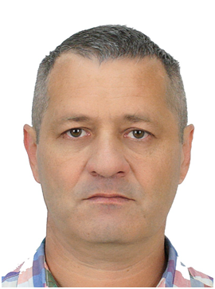

# Земцов Евгений Анатольевич
 г. Москва\
 Телефон: +7 *** *** **** \
 e-mail: <evan77@bk.ru>  
 telegram: https://t.me/ezmts 
 
 
 
 
Поиск  вакансии Android developer\
желаемая зарплата от   *** *** руб

### ОПЫТ РАБОТЫ 

### Группа компаний «ИТЭЛМА»
  Москва, [ИТЭЛМА](https://itelma.ru/)
###### Март 2023 — настоящее время
###### 1 год 8 месяцев	
	

* Ведущий инженер-схемотехник
* Разработка схемотехники устройств для кузовной электроники автомобилей.

### ООО НИЦ "Этан"  г. Москва,  [etan.ru](https://etan.ru)
 
###### 09/2014 –  07/2022 	инженер разработчик, программист

*	Разработка универсальной цифровой шины для промышленного и коммерческого применения в качестве альтернативы существующим стандартам (USB, CAN, RS232-485, ModBus и др.). 
Разработка аппаратной части и софта для датчиков работающих на универсальной шине - датчики движения, присутствия, пожарные, RFID, NFC, датчики тревоги, исполнительные механизмы и другие. 
Разработка  мобильного цифрового измерительного комплекса, а также софта  для него на базе ОС Андроид .
*	Разработка смарт-системы отопления частным домом (управление системой со смартфона через VPN соединение, либо по локальной сети). Аппаратная часть и софт для Андроид устройств.
* 	Разработка устройств на базе NODMCU (модули ESP01-07) - WiFi Switch, WiFi Dimmer. Аппаратная часть и софт для  Андроид устройств.
*	Как хобби, разработка приложений для мобильных устройств на базе ОС Андроид, есть своя страница на Google Play с несколькими [опубликованными приложениями](https://play.google.com/store/apps/developer?id=Appstudio_EZ)
*	[Страница на GITHUB](https://github.com/ezmtsv)
*	Разработка схемотехники, а также многослойных печатных плат для ТВ-тюнеров.

### ООО «КОМПЭЛ» г.Москва,  [compel.ru](https://www.compel.ru)
###### (Поставки компонентов и модулей для производителей электронной аппаратуры)

###### 08/2011 – 07/2014			инженер по применению электронных компонентов

*	 Предложение технических решений российским производителям электроники с использованием элементной базы электронных компонентов  мировых производителей.
*	Косвенное участие в разработке по проекту клиента, поиск оптимальных решений по цене и функционалу за счет применения новейшей базы электронных компонентов.
*	Сопровождение проектов клиента до стадии выхода продукта в массовое производство.
*	Технические консультации сотрудникам отделов продаж. 

### ООО «Антарес»  г. Москва, 
###### торговая  марка  [«BEHOLDER»](http://beholder.ru)

###### (Проектирование, разработка автономных телевизионных   тюнеров)   
###### 03/2005 - 07/2011       инженер разработчик

 Разработка схемотехники, а также многослойных печатных плат телевизионных тюнеров. Разработка программного обеспечения для  заданного алгоритма работы тюнеров (приём, детектирование ТВ сигнала, функции транскодера телевизионных систем, таймер на включение и отключение, настраиваемое OSD меню, управление с помощью пульта ДУ) на базе PIC и 8051 микроконтроллеров (среда программирования MPLAB, Keil uVision3, работа с приложениями PCAD 2006, CAM350). Подготовка документации проекта, гербер файлов и файлов для прошивки к производству. В дальнейшем осуществлялась обратная связь с пользователями продукта и исходя из пожеланий устранение недочетов и редактирование прошивки тюнеров.
Результаты работы и достижения: 
*	Автономный тюнер Behold TV SOLO II, обзор тюнера:  
http://beholder.ru/products/solo2/index.htm
*	Автономный тюнер Behold TV INTRO, обзор тюнера:  
http://beholder.ru/products/intro/index.htm
*	Автономный тюнер Behold TV Theme, обзор тюнера:
http://beholder.ru/products/Theme/index.htm
	

### ООО «СПЕЦЛАБОРАТОРИЯ»  г. Иваново
###### (Конструирование систем охраны) 
###### 11/2003 - 05/2004                 инженер конструктор 

Проектирование, разработка, создание электроники компьютерных охранных систем на базе PIC контроллеров (работа с приложениями P-CAD, MPLAB, языки программирования С+, Ассемблер) 
Результаты работы и достижения: 
*	Разработка 8-ми канального контроллера ключей, контроллера датчиков на 16 мультиплексированных входов, взаимодействие и обмен данными с компьютером по протоколу RS232 на базе PIC контроллеров. 
*   Разработка устройства охраны с оповещением при сработке какого-либо датчика через сотовую связь на базе PIC контроллеров и модулей GSM. 
*   Разработка АЦП с последующей передачей цифровых пакетов данных по радио каналу на базе PIC контроллеров и модулей TLX401.

ОБРАЗОВАНИЕ 1993 - 1999 Ивановский Государственный Энергетический Университет\ 
Специальность: инженер электронщик\
Уровень образования: высшее 

#### Электронные сертификаты
###### 2024
* Итоговый модуль профессии Android разработчик
* Курс Android разработчик
* Продвинутая разработка под Android
* Промышленная разработка под Android	
###### 2023	
* Git - система контроля версий
* Компьютерная грамотность в программировании
* Мобильная аналитика для программистов
* Основы Java
* Основы ООП
* Основы графического дизайна
* Программирование на Kotlin под Android
* Разработка приложений на Kotlin	
  

ЗНАНИЕ ЯЗЫКОВ\
технический английский  

ПРОФЕССИОНАЛЬНЫЕ НАВЫКИ\
  Языки программирования: С, С++, С#, Java, Kotlin, Lua\
  Среды разработки: Visual Studio, IAR, MPLAB,  Keil, Atmel Studio, Android Studio   
  

  ПРОЧЕЕ\
  Дата рождения: 01.07.1969 г.\
  Семейное положение: Женат , 3 детей.\
  Есть водительские права, категория B.
